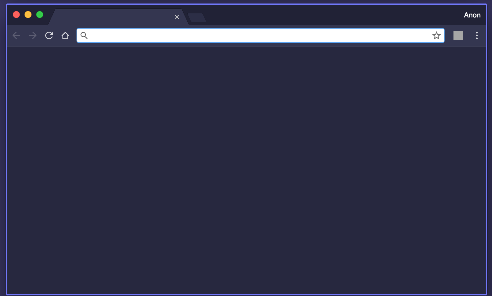

# Purple Theme

A purple, dark theme for Google Chrome.

  

## Installation

1. Clone this repo locally.
2. Visit [`chrome://extensions/`](chrome://extensions/).
3. Enable `Developer mode`.
4. Drag this extension on the page,
